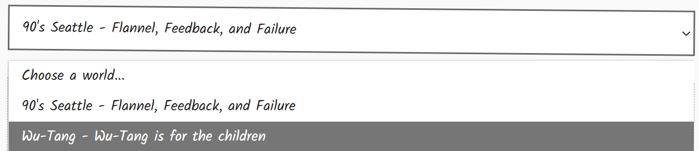

This self-contained html file runs entirely in javascript to generate random mad libs based on data stored in DNS TXT records.

## Demo

https://ttl.ninja/madlibs/

## Walkthrough

### World List

```
;QUESTION
madlibs.ttl.ninja. IN TXT
;ANSWER
madlibs.ttl.ninja. 60 IN TXT "wu-tang.madlibs.ttl.ninja | Wu-Tang | Wu-Tang is for the children"
```



The world list is parsed as next DNS record location, name and description. The name is used to generate the title of the mad lib, and the description is used to generate the tagline.


### World Structure Data

```
;QUESTION
wu-tang.madlibs.ttl.ninja. IN TXT
;ANSWER
wu-tang.madlibs.ttl.ninja. 60 IN TXT "structure|intro(2),act1(2),chorus(2),act2(2),outro(2)"
```


The world structure is parsed to determine the sections of the mad lib that are also record locations. The numbers in parentheses indicate how many sentences to display for that section.


### Mad Lib Generation

```
;QUESTION
act1.wu-tang.madlibs.ttl.ninja. IN TXT
;ANSWER
act1.wu-tang.madlibs.ttl.ninja. 60 IN TXT "Some {noun} from {place} {verb} on the squad, {expletive}! That's war now.|"
act1.wu-tang.madlibs.ttl.ninja. 60 IN TXT "said he was loyal, but the {noun} from {place} {verb} behind my back.|"
act1.wu-tang.madlibs.ttl.ninja. 60 IN TXT "Caught a {noun} in {place}, tried to {verb}, left {adjective} and crying {expletive}.|"
act1.wu-tang.madlibs.ttl.ninja. 60 IN TXT "I {verb} with the {adjective} {noun}, but trust in {place} is fiction.|"
act1.wu-tang.madlibs.ttl.ninja. 60 IN TXT "The {adjective} {noun} from {place} was frontin' 'til I {verb} his whole {noun}.|"
act1.wu-tang.madlibs.ttl.ninja. 60 IN TXT "That {noun} from {place} tried to {verb} me, thought he was {adjective}, but I said {expletive}.|"
act1.wu-tang.madlibs.ttl.ninja. 60 IN TXT "In {place}, I {verb} a {adjective} {noun} who owed me.\"|"
act1.wu-tang.madlibs.ttl.ninja. 60 IN TXT "Back when I {verb} in {place}, we ran with a {adjective} {noun} and no rules.|"
act1.wu-tang.madlibs.ttl.ninja. 60 IN TXT "You don't {verb} a {noun} in {place} without getting {adjective} first.|"
act1.wu-tang.madlibs.ttl.ninja. 60 IN TXT "{place} gave birth to a {noun} who only knew how to {verb} dirty.|"
```


## Real World Implications

This project is inspired by previous research on the use of DNS TXT records to store and retrieve data, which can be used for various purposes including malware distribution and command & control. This is typically done by embedding malicious payloads in DNS records, which can then be resolved by compromised systems. In this case we utilize public API endpoints over HTTPS to retrieve the data from a *trusted* service, obscuring the true source of the data.

### Detection Engineering

This project has been made available to security professionals to test detection capabilities in a non-malicious way. 

#### IOBs

For this project and TXT records in general:

- Cloudflare DNS (http://cloudflare-dns.com/dns-query) being used to resolve TXT records
- Other HTTP-based DNS resolvers exist - treat them as LOTS.
- Long, excessive or unusually formatted TXT records.

### Living Off (LO) Trusted & Abused Resources

Additional LO resources for security professionals:

- Living off Trusted Sites - [https://lots-project.com/](https://lots-project.com/)
- LOL RMM - [https://lolrmm.io/](https://lolrmm.io/)
- Living off Trusted Tunnels -  [https://lottunnels.github.io/](https://lottunnels.github.io/)

### Credits

- Inspired by DomainTool's DNS malware research: [https://dti.domaintools.com/malware-in-dns/](https://dti.domaintools.com/malware-in-dns/)

- The [infosec.exchange](https://infosec.exchange/) community who **really** love DNS

- AI assisted vibe coded POC 😬

